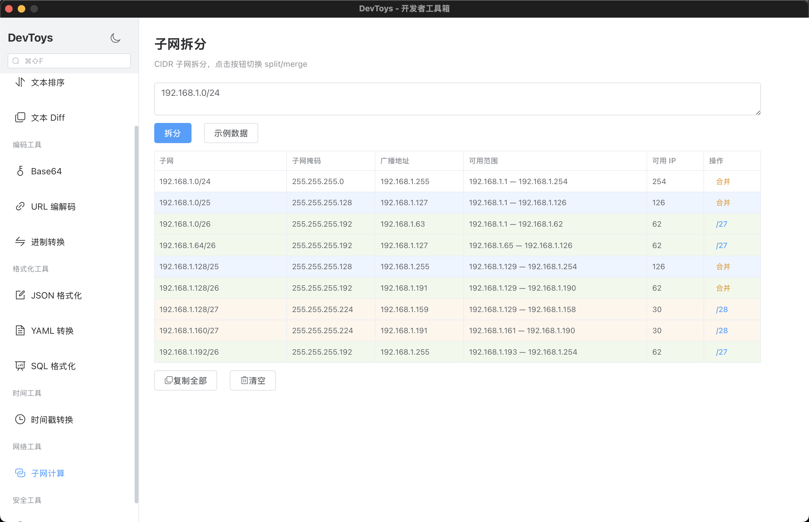

# DevToys

> 原生**桌面**开发者工具箱，基于 [Wails](https://wails.io) v2 + Go + Vue 3。
> 所有数据在本地处理，无需联网，无需后端服务器。
> 使用 Wails 构建，启动迅速、内存占用低、单二进制分发、无运行时依赖。

[English](#devtoys-1)

---



## 功能列表

| 分类 | 工具 | 说明 |
|---|---|---|
| 文本 | 文本去重 | 去除重复行，支持保留顺序/忽略大小写/删除空行 |
| 文本 | 文本排序 | 升序/降序，数字/字符串排序，忽略大小写 |
| 文本 | 文本 Diff | 逐行 LCS 对比，高亮新增/删除 |
| 编码 | Base64 | 编解码，标准 & URL 安全模式 |
| 编码 | URL 编解码 | URL 编码/解码，Query 参数编码/解码，URL 解析 |
| 编码 | 进制转换 | 二进制/八进制/十进制/十六进制互转 |
| 格式化 | JSON 格式化 | 格式化、压缩、校验 JSON |
| 格式化 | YAML 转换 | JSON ↔ YAML 双向互转 |
| 格式化 | SQL 格式化 | 格式化与压缩 SQL 语句 |
| 时间 | 时间戳转换 | Unix 时间戳↔日期，支持秒/毫秒/微秒/纳秒，UTC/本地 |
| 网络 | 子网计算 | CIDR 子网查询、拆分与合并，可视化树形展示 |
| 安全 | 随机密码 | 可配置字符集的随机密码生成 |

## 技术栈

| 层 | 技术 |
|---|---|
| 桌面框架 | Wails v2（原生二进制、低内存、快速启动） |
| 后端语言 | Go 1.24+ |
| 前端框架 | Vue 3 (Composition API) + TypeScript |
| 构建工具 | Vite |
| UI 组件库 | Element Plus |
| 状态管理 | Pinia |
| 路由 | Vue Router (hash history) |
| 语法高亮 | CodeMirror 6 |

## 环境要求

| 工具 | 版本 |
|---|---|
| Go | >= 1.24 |
| Node.js | >= 20 |
| npm | >= 9 |
| Wails CLI | v2.12.0 |

### macOS

```bash
xcode-select --install
```

### Windows

```bash
# 安装 Go: https://go.dev/dl/
# 安装 Node.js: https://nodejs.org/
# 安装 WebView2 (Windows 10+ 已内置)
# 安装 Visual Studio Build Tools 或 GCC (如 Mingw-w64)
# 参考: https://wails.io/docs/next/guides/windows
```

## 快速开始

```bash
# 1. 安装 Wails CLI
go install github.com/wailsapp/wails/v2/cmd/wails@latest

# 确保 $GOPATH/bin 在 PATH 中
export PATH=$(go env GOPATH)/bin:$PATH

# 2. 安装前端依赖
cd frontend && npm install && cd ..

# 3. 开发模式（热重载）
wails dev

# 4. 构建生产版本
wails build

# 5. 运行
# macOS
open build/bin/DevToys.app
# Windows
./build/bin/DevToys.exe
```

## 项目结构

```
DevToys/
├── main.go                    # Wails 入口
├── app.go                     # Wails 桥接层
├── wails.json                 # Wails 配置
├── backend/services/          # Go 业务逻辑
│   ├── result.go              # 统一 Result{code, message, data}
│   ├── json.go                # JSON 格式化/压缩/校验
│   ├── text.go                # 文本去重/排序
│   ├── base64.go              # Base64 编解码
│   ├── diff.go                # 文本 Diff (LCS)
│   ├── timestamp.go           # 时间戳转换
│   ├── url.go                 # URL 编解码与解析
│   ├── password.go            # 随机密码生成
│   ├── yaml.go                # JSON ↔ YAML
│   ├── sql.go                 # SQL 格式化/压缩
│   ├── convert.go             # 进制转换
│   └── subnet.go              # 子网计算
├── frontend/
│   ├── src/
│   │   ├── main.ts            # Vue 入口
│   │   ├── App.vue            # 根布局
│   │   ├── style.css          # 全局样式
│   │   ├── components/        # 公共组件
│   │   │   ├── AppToolLayout.vue
│   │   │   ├── AppTextarea.vue
│   │   │   └── CodeEditor.vue
│   │   ├── layouts/AppSidebar.vue
│   │   ├── pages/             # 工具页面 (12 个)
│   │   ├── router/index.ts    # 路由配置
│   │   └── store/             # Pinia 状态管理
│   └── wailsjs/               # 自动生成的 Wails 绑定
```

## 许可证

[MIT](LICENSE)

---

<h1 id="devtoys-1">DevToys</h1>

> A native **desktop** developer toolbox built with [Wails](https://wails.io) v2 + Go + Vue 3.
> All data stays on your machine — processed locally with no network calls, no backend server.
> Built with Wails, so you get a native app that starts instantly, uses minimal memory,
> and ships as a single binary with zero runtime dependencies.

---


## Features

| Category | Tool | Description |
|---|---|---|
| Text | Text Dedup | Remove duplicate lines, support order/ignore-case/remove-empty |
| Text | Text Sort | Sort lines ascending/descending, numeric/string/ignore-case |
| Text | Text Diff | Line-by-line diff with LCS algorithm, visual add/remove highlights |
| Encoding | Base64 | Encode/decode, standard & URL-safe |
| Encoding | URL Codec | URL encode/decode, query parameter encode/decode, URL parse |
| Encoding | Base Converter | Convert between binary/octal/decimal/hexadecimal |
| Formatting | JSON Formatter | Format, compress & validate JSON |
| Formatting | YAML Convert | JSON ↔ YAML bidirectional conversion |
| Formatting | SQL Formatter | Format & minify SQL statements |
| Time | Timestamp | Unix timestamp ↔ date, support s/ms/us/ns, UTC/local |
| Network | Subnet Calc | CIDR subnet query & split/merge with visual tree |
| Security | Password Gen | Random password generator with configurable character sets |

## Tech Stack

| Layer | Technology |
|---|---|
| Desktop Framework | Wails v2 (native binary, low memory, fast startup) |
| Backend Language | Go 1.24+ |
| Frontend Framework | Vue 3 (Composition API) + TypeScript |
| Build Tool | Vite |
| UI Components | Element Plus |
| State Management | Pinia |
| Router | Vue Router (hash history) |
| Syntax Highlight | CodeMirror 6 |

## Requirements

| Tool | Version |
|---|---|
| Go | >= 1.24 |
| Node.js | >= 20 |
| npm | >= 9 |
| Wails CLI | v2.12.0 |

### macOS

```bash
xcode-select --install
```

### Windows

```bash
# Install Go: https://go.dev/dl/
# Install Node.js: https://nodejs.org/
# WebView2 (built-in on Windows 10+)
# Visual Studio Build Tools or GCC (e.g. Mingw-w64)
# See: https://wails.io/docs/next/guides/windows
```

## Quick Start

```bash
# 1. Install Wails CLI
go install github.com/wailsapp/wails/v2/cmd/wails@latest

# Ensure $GOPATH/bin is in PATH
export PATH=$(go env GOPATH)/bin:$PATH

# 2. Install frontend dependencies
cd frontend && npm install && cd ..

# 3. Development mode (hot reload)
wails dev

# 4. Production build
wails build

# 5. Run
# macOS
open build/bin/DevToys.app
# Windows
./build/bin/DevToys.exe
```

## Project Structure

```
DevToys/
├── main.go                    # Wails entry
├── app.go                     # Wails App binding layer
├── wails.json                 # Wails config
├── backend/services/          # Go business logic
│   ├── result.go              # Unified Result{code, message, data}
│   ├── json.go                # JSON format/compress/validate
│   ├── text.go                # Text dedup/sort
│   ├── base64.go              # Base64 encode/decode
│   ├── diff.go                # Text diff (LCS)
│   ├── timestamp.go           # Timestamp conversion
│   ├── url.go                 # URL codec & parse
│   ├── password.go            # Password generator
│   ├── yaml.go                # JSON ↔ YAML
│   ├── sql.go                 # SQL format/minify
│   ├── convert.go             # Base converter
│   └── subnet.go              # Subnet calculator
├── frontend/
│   ├── src/
│   │   ├── main.ts            # Vue entry
│   │   ├── App.vue            # Root layout
│   │   ├── style.css          # Global styles
│   │   ├── components/        # Shared components
│   │   │   ├── AppToolLayout.vue
│   │   │   ├── AppTextarea.vue
│   │   │   └── CodeEditor.vue
│   │   ├── layouts/AppSidebar.vue
│   │   ├── pages/             # Tool pages (12 tools)
│   │   ├── router/index.ts    # Routes
│   │   └── store/             # Pinia stores
│   └── wailsjs/               # Auto-generated Wails bindings
```
## License

[MIT](LICENSE)
